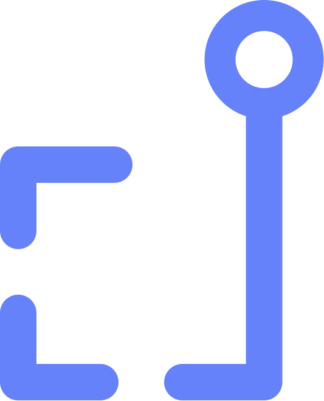

<p align="center">
  
</p>

# dam.rs

[](https://github.com/skippednote/dam.rs/actions/workflows/ci.yml)
[](LICENSE)

**Rights-aware digital asset management.**

Find it. Trust it. Use it.

dam.rs is a self-hosted digital asset management system that keeps search, rights, provenance,
derivatives, storage, and delivery in one auditable workflow. It is built in Rust, backed by PostgreSQL
and S3-compatible object storage, and operated through a Svelte interface designed for large media
libraries.

> **Project status: active development.** The core library, ingest, metadata, search, rights, delivery,
> sharing, archival, hosted enrichment, governance and operator interface are implemented, including a
> hash-chained audit record, user administration and SCIM 2.0 provisioning. [TASKS.md](TASKS.md) is the
> ledger, item by item, including what is still open.
>
> Two things to know before evaluating it:
>
> - **There is no human login yet.** Everybody — person, connected site, or SCIM-provisioned account —
>   authenticates with an API key. SCIM creates accounts and access and deliberately mints no credential,
>   so a provisioned person needs a key from an administrator until SSO lands. Deprovisioning is
>   unaffected and complete.
> - **Delivery serves one tenant per process.** The signed claim carries the tenant and delivery checks
>   it, but the library is still resolved from configuration rather than from the claim, so one `damd`
>   answers delivery for one tenant. A deployment needing delivery for several runs one per tenant.

## Why dam.rs

- **Rights are enforced at delivery.** A green badge is useful context, not permission by itself.
- **Provenance survives the pipeline.** Content credentials are read, preserved, and re-signed on
  derivatives when signing is configured.
- **Cold assets remain discoverable.** Originals can tier to archival storage without disappearing from
  search, metadata, or previews.
- **Search is one system.** Lexical, faceted, and semantic retrieval share an explainable query model.
- **Automation stays accountable.** AI-written metadata carries provenance, review state, and spend
  controls.
- **Tenants fail closed.** Database schemas, authorization, signed delivery, and audit records are designed
  around explicit boundaries.

## The system in one minute

```text
Browser / Drupal / MCP
          │
          ▼
       damd API ────── PostgreSQL (global registry + schema per tenant)
          │
          ├────────── S3-compatible object storage
          │
          └────────── durable jobs ──► dam-worker
                                      ├─ verify and promote uploads
                                      ├─ extract metadata and render derivatives
                                      ├─ evaluate provenance and rights
                                      └─ index assets for search
```

The API never proxies master files. It evaluates access and intended use, records the decision, then
issues a short-lived signed delivery URL. Read [ARCHITECTURE.md](ARCHITECTURE.md) for the system invariants
and [DECISIONS.md](DECISIONS.md) for the trade-offs behind them.

## Local development

Requirements are pinned through [mise](https://mise.jdx.dev/). Docker supplies PostgreSQL and SeaweedFS.

```sh
mise install
mise run up
mise run dev:seed
```

`dev:seed` prints a development API key once. Start each long-running process in its own terminal:

```sh
mise run dev:api
mise run dev:worker
mise run dev:web
```

Open the URL printed by Vite, visit Settings, and paste the generated key. The worker is required: uploads
remain in staging until it verifies, promotes, derives, and indexes them.

## Verification

```sh
mise run check       # Rust formatting, clippy, tests
mise run check:deny  # advisories, licences, bans, sources — the same four CI runs
mise run check:web   # Svelte checks, lint, unit tests, browser and accessibility suites
mise run check:all   # all three
```

The browser suite includes axe checks in both themes, keyboard navigation, virtual-grid semantics, and
the major asset workflows. Generated API types come from the checked-in OpenAPI document.

One gate sits outside `check:all`, because it bills a real AWS account and waits on a real restore:

```sh
AWS_PROFILE=… AWS_REGION=… DAMRS_TEST_BUCKET=… mise run check:aws
```

Point it at a throwaway bucket. The suite writes to Glacier, which bills a 90-day minimum on every object
it touches — deleting the object does not cancel that — so a bucket made for the run and removed after it
is the cheapest shape as well as the tidiest.

If the profile is an SSO one, run `aws sso login` first. A working `aws` CLI is not evidence that this
will run: the CLI can serve role credentials from its own cache after the SSO portal token has expired,
while the SDK needs that token and fails with `Session token not found or invalid`, which names neither
SSO nor the remedy.

That gate is the only place real Glacier semantics are exercised, and it has been run: against S3 in
`ap-south-1`, twenty cases passed with none skipped and a restore completed in 77 seconds, serving back
the original bytes. A local S3 server and a fake store with a controllable clock give the wire protocol
and the tiering state machine; neither can prove an actual `RestoreObject`, and both _skip_ those cases
rather than claim them — which is why the run asserts that the skip count is zero.

## Deployment

The repository builds one backend image containing `damd`, `dam-worker`, and `damctl`. The Svelte frontend
is deployed separately. Production additionally requires TLS termination, a reverse proxy, human
authentication, configured virus scanning, durable search storage, and an operational backup policy.

Read [docker/DEPLOY.md](docker/DEPLOY.md) before treating an image as a deployment.

## Documentation

- [Architecture](ARCHITECTURE.md) — boundaries, invariants, data model, and intended system.
- [Decisions](DECISIONS.md) — implementation choices and evidence.
- [Implementation queue](TASKS.md) — completed and remaining work.
- [Contributing](CONTRIBUTING.md) — how to build, what the gates are, and what a good change looks like.
- [Security](SECURITY.md) — what is in scope and how to report it privately.
- [Deployment](docker/DEPLOY.md) — image, configuration, rollout order, probes, and operations.
- [Brand guide](docs/brand/README.md) — identity, logo, colour, typography, and voice.
- [Frontend](web/README.md) — Svelte development and accessibility conventions.
- [Building dam.rs](https://skippednote.dev/series/building-dam-rs/) — six posts on why this exists:
  what the established platforms cost, why their archival story is usually unusable, where rights have to
  be enforced, and what building it taught us.

## Licence

Apache-2.0 — see [LICENSE](LICENSE) and [NOTICE](NOTICE). Every workspace crate is marked unpublished, so
no part of this reaches crates.io by accident; the version numbers are internal and mean nothing to a
registry.
