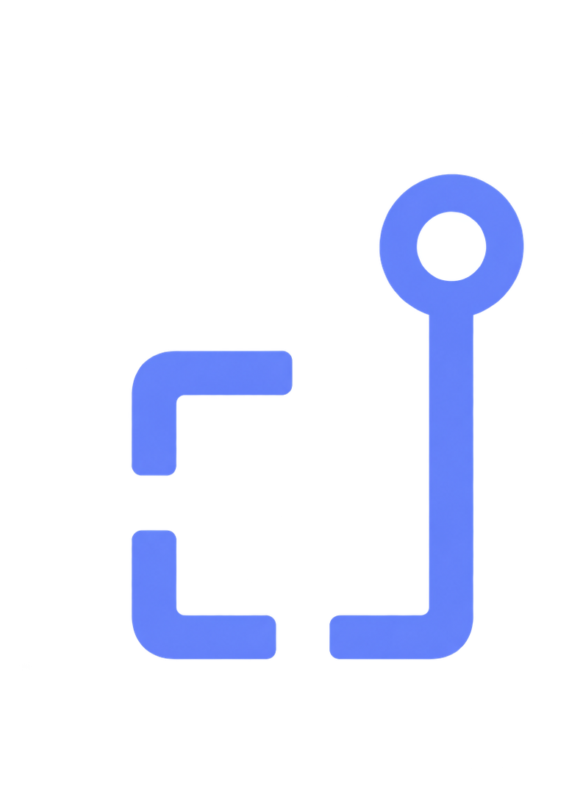

<p align="center">
  
</p>

# dam.rs

**Rights-aware digital asset management.**

Find it. Trust it. Use it.

dam.rs is a self-hosted digital asset management system that keeps search, rights, provenance,
derivatives, storage, and delivery in one auditable workflow. It is built in Rust, backed by PostgreSQL
and S3-compatible object storage, and operated through a Svelte interface designed for large media
libraries.

> **Project status:** active development. The core library, ingest, metadata, search, rights, delivery,
> sharing, archival, hosted enrichment, and operator interface are implemented. Human login/SSO and
> other pre-GA work are still open; see [TASKS.md](TASKS.md) for the current implementation ledger.

## Why dam.rs

- **Rights are enforced at delivery.** A green badge is useful context, not permission by itself.
- **Provenance survives the pipeline.** Content credentials are read, preserved, and re-signed on
  derivatives when signing is configured.
- **Cold assets remain discoverable.** Originals can tier to archival storage without disappearing from
  search, metadata, or previews.
- **Search is one system.** Lexical, faceted, and semantic retrieval share an explainable query model.
- **Automation stays accountable.** AI-written metadata carries provenance, review state, and spend
  controls.
- **Tenants fail closed.** Database schemas, authorization, signed delivery, and audit records are designed
  around explicit boundaries.

## The system in one minute

```text
Browser / Drupal / MCP
          │
          ▼
       damd API ────── PostgreSQL (global registry + schema per tenant)
          │
          ├────────── S3-compatible object storage
          │
          └────────── durable jobs ──► dam-worker
                                      ├─ verify and promote uploads
                                      ├─ extract metadata and render derivatives
                                      ├─ evaluate provenance and rights
                                      └─ index assets for search
```

The API never proxies master files. It evaluates access and intended use, records the decision, then
issues a short-lived signed delivery URL. Read [ARCHITECTURE.md](ARCHITECTURE.md) for the system invariants
and [DECISIONS.md](DECISIONS.md) for the trade-offs behind them.

## Local development

Requirements are pinned through [mise](https://mise.jdx.dev/). Docker supplies PostgreSQL and SeaweedFS.

```sh
mise install
mise run up
mise run dev:seed
```

`dev:seed` prints a development API key once. Start each long-running process in its own terminal:

```sh
mise run dev:api
mise run dev:worker
mise run dev:web
```

Open the URL printed by Vite, visit Settings, and paste the generated key. The worker is required: uploads
remain in staging until it verifies, promotes, derives, and indexes them.

## Verification

```sh
mise run check       # Rust formatting, clippy, tests, advisories, licences, sources
mise run check:web   # Svelte checks, lint, unit tests, browser and accessibility suites
mise run check:all   # both gates
```

The browser suite includes axe checks in both themes, keyboard navigation, virtual-grid semantics, and
the major asset workflows. Generated API types come from the checked-in OpenAPI document.

## Deployment

The repository builds one backend image containing `damd`, `dam-worker`, and `damctl`. The Svelte frontend
is deployed separately. Production additionally requires TLS termination, a reverse proxy, human
authentication, configured virus scanning, durable search storage, and an operational backup policy.

Read [docker/DEPLOY.md](docker/DEPLOY.md) before treating an image as a deployment.

## Documentation

- [Architecture](ARCHITECTURE.md) — boundaries, invariants, data model, and intended system.
- [Decisions](DECISIONS.md) — implementation choices and evidence.
- [Implementation queue](TASKS.md) — completed and remaining work.
- [Acquia parity](ACQUIA-PARITY.md) — comparator coverage.
- [Deployment](docker/DEPLOY.md) — image, configuration, rollout order, probes, and operations.
- [Brand guide](docs/brand/README.md) — identity, logo, colour, typography, and voice.
- [Frontend](web/README.md) — Svelte development and accessibility conventions.

## Licence

Apache-2.0. Internal workspace crates are marked unpublished to prevent accidental registry releases.
